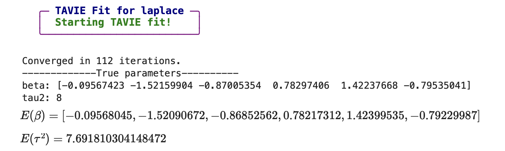
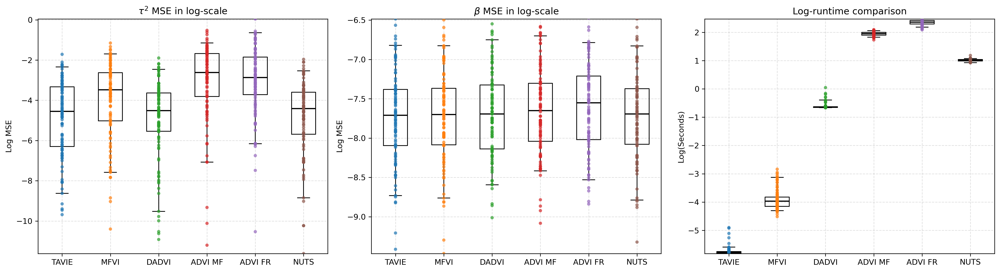
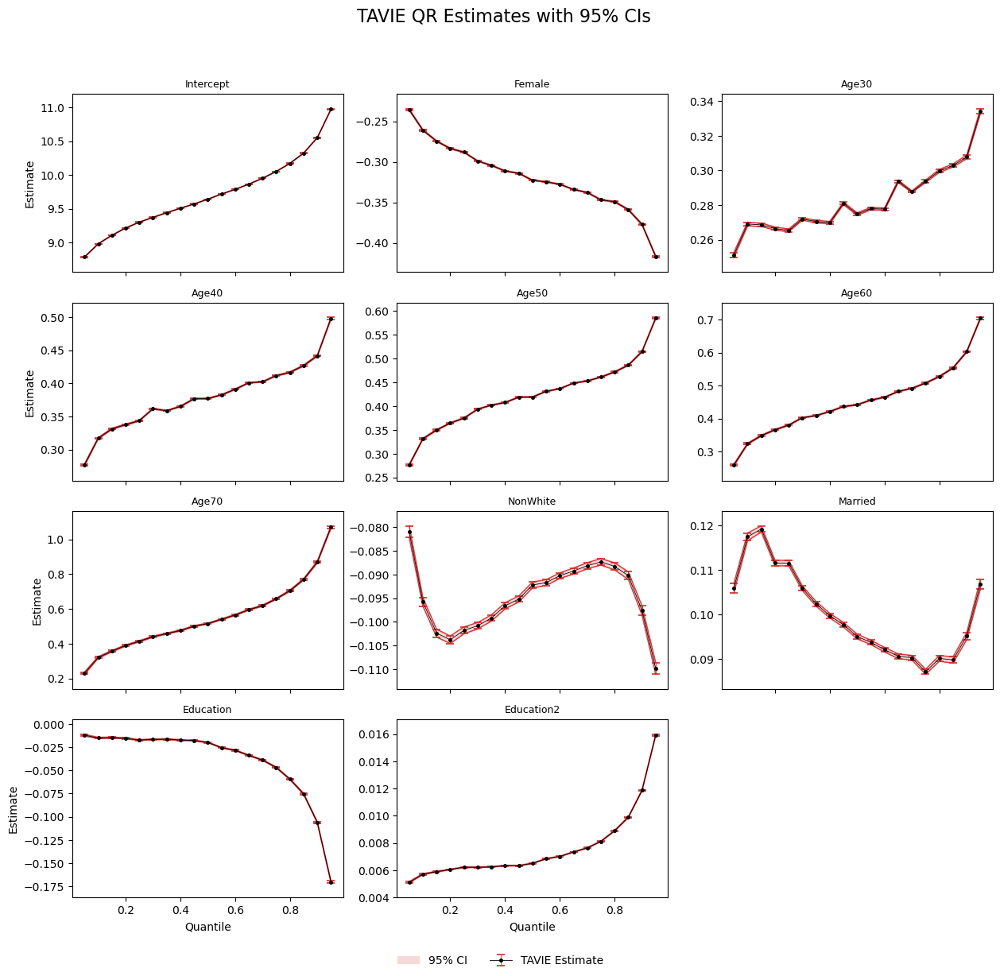
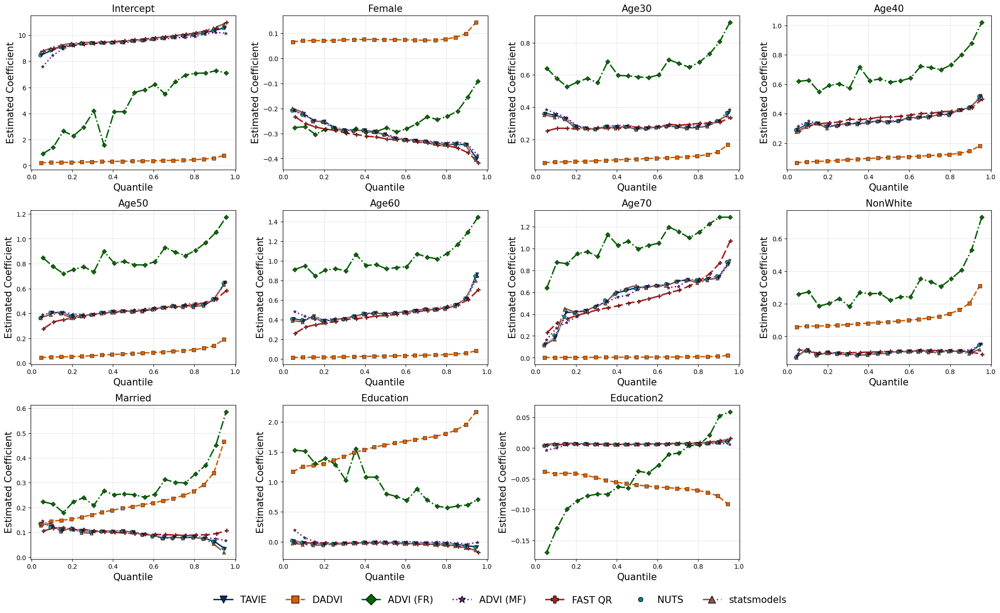
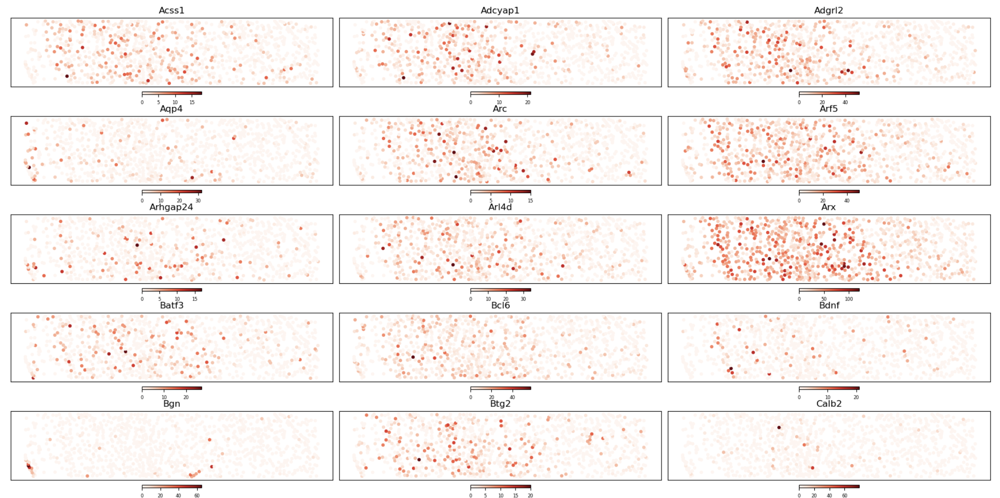
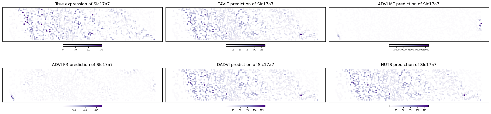
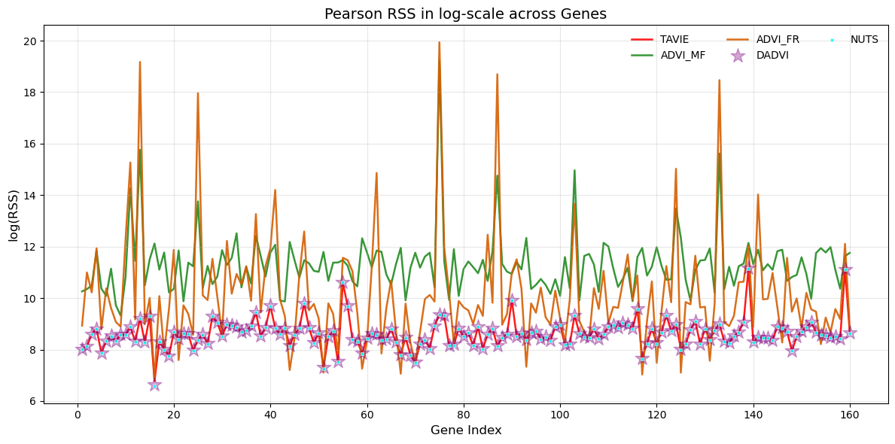

# TAVIE: A Generalized Tangent Approximation Framework for Strongly Super-Gaussian Likelihoods

[](https://www.python.org/)
[](./LICENSE)
[](https://arxiv.org/abs/2504.05431)
[](https://github.com/Roy-SR-007/TAVIE/network)
[](https://github.com/Roy-SR-007/TAVIE)
[](https://github.com/Roy-SR-007/TAVIE/commits/main)
[](https://github.com/Roy-SR-007/TAVIE/issues)
[](https://github.com/Roy-SR-007/TAVIE/pulls)


<p align="center">
  
</p>

This repository holds the source code and implementation of *Tangent Approximation based Variational InferencE* (**TAVIE**) proposed in Roy, S., Dey, P., Pati, D., & Mallick, B. K. (2025), *A Generalized Tangent Approximation Framework for Strongly Super‑Gaussian Likelihoods*, [arXiv:2504.05431](https://arxiv.org/abs/2504.05431).

---

## Developers and Maintainers

**Somjit Roy**  
Department of Statistics  
Texas A&M University, College Station, TX, USA  

📧 Email: [sroy_123@tamu.edu](mailto:sroy_123@tamu.edu)  
🌐 Website: [https://roy-sr-007.github.io](https://roy-sr-007.github.io)

**Pritam Dey**  
Department of Statistics  
Texas A&M University, College Station, TX, USA  

📧 Email: [pritam.dey@tamu.edu](mailto:pritam.dey@tamu.edu)  
🌐 Website: [https://pritamdey.github.io](https://pritamdey.github.io)

---

## NEWS

- This is the first official release of `TAVIE v1.0.0` on `GitHub`.
- Explore different example cases, settings and usage of TAVIE across various strongly super-Gaussian (SSG) likelihoods with comparison against other state-of-the-art variational inference (VI) algorithms.
- Application of TAVIE in real-word data studies has also been presented.
- Though TAVIE can run on any `Python` IDEs, we recommend using [Visual Studio Code](https://code.visualstudio.com/).

---

## Overview

*Variational inference* (VI), a concept rooted from statistical physics, has gained recent traction as a contender to prevalent Markov chain Monte Carlo (MCMC) sampling techniques used for posterior inference. VI has transformed approximate Bayesian inference through its power of scaling compute time under big data with applications extending out to the realm of *machine learning*, specifically in *graphical models* ([Wainwright and Jordan, 2008](https://www.nowpublishers.com/article/Details/MAL-001); [Jordan et al., 1999](https://link.springer.com/article/10.1023/A:1007665907178)), *hidden Markov models* (HMMs) ([MacKay, 1997](http://www.inference.org.uk/mackay/ensemblePaper.pdf)), *latent class models* ([Blei et al., 2003](https://jmlr.csail.mit.edu/papers/v3/blei03a.html)), and *neural networks* (NNs) ([Graves, 2011](https://papers.nips.cc/paper_files/paper/2011/hash/7eb3c8be3d411e8ebfab08eba5f49632-Abstract.html)). *Tangent approximation* ([Jaakkola and Jordan, 2000](https://link.springer.com/article/10.1023/A:1008932416310)), forming a popular class of VI techniques in intractable non-conjugate models has been used in diverse modeling frameworks like *low-rank approximations* ([Srebro and Jaakkola, 2003](https://people.csail.mit.edu/tommi/papers/SreJaa-icml03.pdf)), *sparse kernel machines* ([Shi and Yu, 2019](https://proceedings.neurips.cc/paper/2019/hash/bcc0d400288793e8bdcd7c19a8ac0c2b-Abstract.html)), and *online prediction* ([Konagayoshi and Watanabe, 2019](https://proceedings.mlr.press/v101/konagayoshi19a.html)). However, these applications have been primarily confined to *logistic regression* setting with [Ghosh et al., 2022](https://www.jmlr.org/papers/v23/21-0190.html) being the first ones to investigate optimality and algorithmic stability of tangent transformation based variational inference in *logit* and *multinomial logit* models. Taking a step forward, we develop TAVIE for *strongly super-Gaussian* (SSG) likelihood functions which encompasses a broad class of flexible probability models beyond the framework of logit models. Based on the principle of *convex duality*, TAVIE obtains a quadratic lower bound of the corresponding log-likelihood, thus inducing conjugacy with Gaussian priors over the model parameters. With TAVIE, we also address the challenge of rigorously characterizing the statistical behavior of the variational posterior by developing optimality (near-minimax variational risk bounds) under the fractional likelihood setup.

<p align="center">
  
  <br><em>Tangent minorizers for Student's-t likelihood, animated over 50 values of the variational parameter ξ</em>
</p>

TAVIE works for a large class of SSG likelihoods, comprising mainly of the following types of families:
- **Type I families**: These comprise of linear regression models with heavy-tailed error distributions. Notable families of error distributions which can be addressed by TAVIE include the *Laplace* (*Double-Exponential*) and *Student's-t*. In general, any *scaled-mixture* of *zero-mean Gaussian* distributions have the SSG form, and thus can be implemented using TAVIE.
- **Type II families**: These comprise of *generalized linear models* (GLMs) with *Binomial* (including Bernoulli/Logistic) and *Negative-Binomial* response distributions.
- **Bayesian quantlile regression**: As an extension of the Type-I likelihood to the *asymmetric Laplace distribution*.

Due to the large class of models which can be fitted and infered from using TAVIE, it can be applied to a broad class of real world problems spanning applications in finance and economics, as well as in biostatistics viz., gene expression modeling, microbiome studies and neuroscience. We showcase the implementation and application of TAVIE in two real-world data studies: (i) *quantile regression* in U.S. 2000 Census data to understand the effect of different *demographic features* on the *annual salary*, and (ii) *Negative-Binomial* regression to predict *gene expressions* across different spatial locations in the STARmap data.

---

## Installation and Dependencies

To get started with TAVIE, which is build on `Python==3.13.5`, clone the current Github repository and install the required dependencies:

* `ipython`
* `matplotlib`
* `numpy`
* `pandas`
* `rich`
* `scikit_learn`
* `scipy`
* `torch`
* `tqdm`
* `toolz`
* `pymc`
* `pytensor`

```bash
# using SSH on bash
git clone git@github.com:Roy-SR-007/TAVIE.git

# or, using HTTPS on bash
git clone https://github.com/Roy-SR-007/TAVIE.git

# moving to the TAVIE directory
cd TAVIE

# install the required dependencies
pip install -r requirements.txt
```
---

## Functionalities of the TAVIE class

The `TAVIE` package wrapped in the 'TAVIE' folder deals with the implementation of the corresponding tangent transformation VI algorithm under various SSG probability models. It provides flexible, modular support across different likelihood families and modeling tasks.


| Class             | Target SSG Model               | Supported Likelihoods                               | Prior Type                  |
|-------------------|--------------------------------|-----------------------------------------------------|-----------------------------|
| `TAVIE_loc_scale` | Heavy-tailed location-scale family (Type I SSG) | Laplace, Student’s-t, Custom location-scale         | Gaussian × Inverse-Gamma    |
| `TAVIE_type_II`    | Count GLMs (Type II SSG)     | Binomial, Negative-Binomial                         | Gaussian                    |
| `TAVIE_QR`         | Quantile Regression           | Asymmetric Laplace distribution            | Gaussian                    |


For importing all these aforementioned classes and initializing them:

```python
# importing all the TAVIE classes
from TAVIE import *

# initializing the TAVIE location-scale, TAVIE_QR, and TAVIE_type_II models respectively

## following is the location-scale example for 'laplace', other options are 'student' and 'loc_scale' (for general location-scale family)
loc_scale_model = TAVIE_loc_scale(fit_intercept=True, scale_X=False, scale_y=False, family="laplace", afunc=None, cfunc=None)

## following is the example for initializing the quantile regression TAVIE model
qr_model = TAVIE(fit_intercept=True, scale_X=False, scale_y=False)

## following is the Type II SSG example for 'negbin' (Megative-Binomial regression), the other option is 'binomial' for Logistic regression
type_II_model = TAVIE_type_II(fit_intercept=True, scale_X=False, family="negbin")
```

**Note**: When initializing the *TAVIE location-scale model* under **custom** location-scale error distribution family, the user is required to pass callable functions `afunc` and `cfunc` to the `TAVIE_loc_scale()` class, as discussed in the subsequent section.

---

### Callable functions `afunc` and `cfunc` in `TAVIE_loc_scale()` for custom location-scale family

The *callable* functions `afunc` and `cfunc` are defined in terms of the probability density function (PDF) of the location-scale error distribution family. In other words, when performing the regression $y_i = \boldsymbol{X}_i^{\top}\boldsymbol{\beta} + \epsilon_i$, where $\epsilon_i/\tau$ has the PDF $p(x)$, the functions $A(x)$ and $c(x)$ are defined as:

$$
A(x) = -\frac{p'(x)}{2x\cdot p(x)} =(2x)^{-1}\cdot \frac{d}{dx}\log p(x),
$$

$$
c(x) = \log p(x)  - \frac{x\cdot p'(x)}{2\cdot p(x)} = \log p(x) - \frac{x}{2}\cdot \frac{d}{dx}\log p(x),
$$

where $p'(x) = \frac{d}{dx} p(x)$. In particular, when calling `TAVIE_loc_scale()` class for `family="laplace"` and `family="student"`, the computation of the callable functions `afunc` and `cfunc` are performed in-built.

---

### Components of each TAVIE class

For each of the TAVIE class listed above, following are the components and their respective functionalities.


| Method Name                   | `TAVIE_loc_scale` | `TAVIE_type_II` | `TAVIE_QR` | Description                                                                 |
|-------------------------------|-------------------|-----------------|------------|-----------------------------------------------------------------------------|
| `fit()`                       | ✅                | ✅               | ✅         | Fits the TAVIE model                                            |
| `get_TAVIE_means()`           | ✅                | ✅               | ✅         | Returns (and optionally displays) the TAVIE posterior means of parameters   |
| `get_variational_estimates()` | ✅                | ✅               | ✅         | Returns a dictionary of variational estimates of the hyper-parameters           |
| `get_elbo()`                  | ✅                | ✅               | ✅         | Returns ELBO values tracked across iterations                               |

✅ = Supported. We give example usage of each of these above listed functions below for various SSG likelihoods considered in TAVIE.

---

## TAVIE in action for SSG Type I family: Laplace likelihood

We consider showing the utilities of each components in the `TAVIE_loc_scale()` class, particularly for the SSG Type I family having the *Laplace* likelihood of the form:

**Laplace error model**: $y_i = \beta_0 + \boldsymbol{X}_i^\top \boldsymbol{\beta} + \epsilon_i, \quad \text{where } \epsilon_i \sim \text{Laplace}(0, \sigma=\tau^{-1})$, for $i=1,2,\ldots,n$ with $f(\epsilon \mid \tau) = \frac{\tau}{2} \exp\left( -\tau \cdot |\epsilon| \right)$.

**Prior**: $(\boldsymbol{\beta}, \tau^2)$ is endowed upon with a prior as, $\boldsymbol{\beta}\mid \tau^2 \sim N(\boldsymbol{m}, \boldsymbol{V}/\tau^2)$ and $\tau^2\sim Gamma(a/2, b/2)$.

We first generate the data from the Laplace model with data parameters:
* $(n, p, \tau^2_{\text{true}}) = (10000, 5, 8)$,
* The design matrix $X\in \mathbb{R}^{p+1}$ comprise of entries from the *standard normal distribution* with the first column being $1_n$ automatically added by the `TAVIE_loc_scale()` class on choosing `fit_intercept=True`,
* $\boldsymbol{\beta}_{\text{true}} = (\beta_0, \beta)\in \mathbb{R}^{p+1}$ is also generated from the *standard normal distribution*, and
* $\epsilon_i \sim Laplace(0, \tau_{\text{true}}^{-1})$.

```python
# Simulated data
n = 10000
p = 5
tau2 = 8

# Design matrix, true regression coefficients and response
X = np.random.normal(size=(n, p))
beta_true = np.random.normal(loc=0.0, scale=1.0, size=p+1)
error = np.random.laplace(size=n, loc=0.0, scale = 1/np.sqrt(tau2))
y = beta_true[0] + X @ beta_true[1:len(beta_true)] + error
```

Consequently, we initialize the TAVIE model and *fit* the initialized model using `fit()` for this particular Laplace likelihood:

```python
# Initialize the TAVIE model for laplace likelihood
laplace_model = TAVIE_loc_scale(family="laplace", fit_intercept=True) # choosing an intercept term
laplace_model.fit(X, y, verbose=True) # fit the TAVIE model
```

Now that the TAVIE model has been fit, we obtain the resultant *estimated TAVIE means* of $\beta_{\text{true}}$ and $\tau_{\text{true}}$ using the `get_TAVIE_means()` functionality along with printing them on the console using the `verbose=True` argument:

```python
laplace_model.get_TAVIE_means(verbose=True) # get the TAVIE estimates
```

<p align="center">
  
  <br><em>Results of TAVIE for the Laplace model</em>
</p>

If the user is interested to obtain the *variational estimates* of the hyper-parameters ($\boldsymbol{m}$, $\boldsymbol{V}$, $a$, $b$), it can be done using `get_variational_estimates()`:

```python
# obtain the variational parameter estimates; use 'variational_est' as required
variational_est = laplace_model.get_variational_estimates()
```

To check the convergence diagnostics, we also have the `get_elbo()` functionality that could be used to obtain the *evidence lower bound* (ELBO) history over iterations:

```python
ELBO = laplace_model.get_elbo() # get the ELBO across iterations
```

<p align="center">
  
  <br><em>TAVIE converged in 112 iterations</em>
</p>

**Note**: TAVIE applied to other SSG likelihoods along with the utilities of each component in the different TAVIE classes have been illustrated in [TAVIE_examples.ipynb](./TAVIE_examples.ipynb).

---

## TAVIE vs other state-of-the-art competing algorithms

We present a bake-off of TAVIE against competing variational inference and MC sampling algorithms viz.,
* `ADVI (MF)`: Automatic Differentiation Variational Inference ([Kucukelbir et al., 2017](https://jmlr.org/papers/v18/16-107.html)) in mean-field setting;
* `ADVI (FR)`: ADVI in full-rank setting;
* `DADVI`: Deterministic second-order ADVI ([Giordano et al., 2024](https://jmlr.org/papers/v25/23-1015.html));
* `MFVI`: Mean-Field Variational Inference ([Wand et al., 2011](https://matt-p-wand.net/publicns/Wand11.pdf)) (for Student's-t SSG likelihood only); and
* `NUTS`: No-U-Turn Monte Carlo Sampling algorithm from the [`PyMC`](https://www.pymc.io/welcome.html) python package ([Patil et al., 2010](https://www.jstatsoft.org/v035/i04)).

To exemplify the performance of TAVIE against these competing methods, we illustrate the case of applying TAVIE to the *Student's-t* SSG likelihood.

<p align="center">
  
  <br><em>Comparison of TAVIE against the competing methods under the Student's-t SSG model [n=1000; p=5]</em>
</p>

<div align="center">

| Method   | MSE of $\beta$              | MSE of $\tau^2$            | run-time                |
|----------|-----------------------------|----------------------------|-------------------------|
| **TAVIE** | **5.140e-04 ± 1.011e-03**       | **2.425e-02 ± 1.558e-01**       | **3.255e-03 ± 4.158e-03**   |
| **MFVI**  | 5.177e-04 ± 9.888e-04       | 5.451e-02 ± 2.611e-01       | 2.155e-02 ± 3.697e-02   |
| **DADVI** | 5.266e-04 ± 1.043e-03       | **2.225e-02 ± 1.279e-01**       | 5.480e-01 ± 5.018e-01   |
| **ADVI MF** | 5.439e-04 ± 8.422e-04    | 1.173e-01 ± 4.751e-01       | 7.067e+00 ± 1.404e+00   |
| **ADVI FR** | 5.800e-04 ± 1.148e-03    | 1.519e-01 ± 1.414e+00       | 1.057e+01 ± 2.495e+00   |
| **NUTS**   | **5.128e-04 ± 1.012e-03**      | **2.230e-02 ± 1.183e-01**       | 2.753e+00 ± 5.236e-01   |

**Average metrics for Student's-t SSG with** $(n, p) = (1000, 5)$. **Bold** represents superior performance.

</div>


These results demonstrate that TAVIE consistently matches or exceeds the accuracy of competing algorithms while delivering results orders of magnitude faster. To see results for varying sample sizes and number of features across different SSG likelihoods, refer to:

<div align="center">

| Description                   | `ipynb` file name | 
|-------------------------------|-------------------|
| Laplace                       | [Laplace_comparisons_dadvi_tavie_bbvi.ipynb](Laplace_comparisons_dadvi_tavie_bbvi.ipynb) |
| Student's-t                    | [Student_comparisons_dadvi_tavie_mfvi_bbvi.ipynb](Student_comparisons_dadvi_tavie_mfvi_bbvi.ipynb) |
| Negative-Binomial              | [NegBin_comparisons_dadvi_tavie_bbvi.ipynb](NegBin_comparisons_dadvi_tavie_bbvi.ipynb) |
| General view of all results and metrics | [viewing_results.ipynb](viewing_results.ipynb) |

</div>

**Note**: All the competing methods except DADVI and PyMC NUTS have been implemented in [CompetingMethods](CompetingMethods) directory. For implementing PyMC NUTS, the `Python` package `pymc` is to be installed and loaded. DADVI runs in its own dedicated `conda` environment with all the requirements installed; refer to [https://github.com/martiningram/dadvi](https://github.com/martiningram/dadvi) for the complete setup of DADVI.

While *black-box variational inference* (BBVI) algorithms can yield reasonable approximations, they typically incur higher run-times and lack theoretical guarantees. Across all numerical experiments, TAVIE consistently demonstrates stronger empirical performance than the various BBVI methods. Although BBVI algorithms converge (refer to [convergence.ipynb](convergence.ipynb)), their estimates are generally less accurate than those produced by TAVIE.

---

## Real data application

We exemplify the application of TAVIE in two real-data studies as follows.

- **Quantile regression with U.S. 2000 Census data**: TAVIE is applied to perform *quantile regression* (hereby referred to as `TAVIE QR`) on the U.S. 2000 Census data (<http://www.census.gov/census2000/PUMS5.html>) to infer about the behavior of *log annual salary* with respect to different *demographic* characteristics. In particular, state-level Census 2000 data containing individual records of the characteristics for a $5\%$ sample of people and housing units has been taken into account. The log of annual salary is treated as the response with demographic characteristics (*gender*, *age*, *race*, *marital status*, and *education level*) of people with $40$ or more weeks of work in the previous year and $35$ or more hours per week of work, constitutes the set of primary features. `TAVIE QR`'s performance is compared with a fast approximate algorithm for quantile regression `Fast QR` (Algorithm $5$ in [Yang et al., 2013](http://proceedings.mlr.press/v28/yang13f.pdf)), where both the methods are applied on the U.S. 2000 Census dataset. Additionally, we also compare `TAVIE QR` with all the aformentioned competing methods (DADVI, ADVI (MF), ADVI (FR), NUTS) and a built-in quantile regression module from the `Python` package `statsmodels`.

- **Negative-Binomial regression for predicting gene expressionsin STARmap data**: We use our TAVIE Negative-Binomial model for predicting gene expressions in the **STARmap** *spatial transcriptomics* data set (<https://lce.biohpc.swmed.edu/star/explorer.php>). STARmap consists of data from $4$ mice. The experimental mice were dark housed for $4$ days and then either exposed to light or kept in the dark for another one hour before obtaining measurements from the primary visual cortex of each of the mouse brain. The data comprises of the expression of $160$ genes with the number of cells varying between from $931$ to $1167$ for the $4$ diferent mice. We compare the performance of TAVIE, ADVI (MF), ADVI (FR), DADVI, and NUTS in predicting the gene expressions over different spatial locations.

### TAVIE for Bayesian quantile regression in U.S. 2000 Census data

We fit the `TAVIE_QR()` module (class) on $n = 5 \times 10^6$ data points across $p=11$ features (viz., `Female`, `Age30`, `Age40`, `Age50`, `Age60`, `Age70`, `NonWhite`, `Married`, `Education`, `Education2`, and `Intercept`). Following are the plots of the `TAVIE QR` estimates for different quantiles across each of the variables along with the corresponding $95%$ confidence bands.

<p align="center">
  
  <br><em>TAVIE QR estimates along with 95% confidence bands</em>
</p>

Following are the quantile estimates across different features for all the methods. These results correspond to running the algorithms (except `FAST QR`) on $n=10000$ data points because of the high run-time incurred by `DADVI`.

<p align="center">
  
  <br><em>Comparison of TAVIE QR and competing methods</em>
</p>

Observe that, the `TAVIE QR` estimates (using $n=10000$) almost coincides with the `FAST QR` estimates (implemented on the full dataset) in the plot above. It is important to note that, `FAST QR` aims at providing scalable quantile regression solutions in large-scale problems, which is beyond the scope of TAVIE and is only used as a means of empirical validation. The estimates from `TAVIE QR`, `ADVI (MF)`, `NUTS`, and `statsmodels` compares well with `FAST QR`. For the detailed code implementation, refer to [census_QR_data_study_main.ipynb](census_QR_data_study_main.ipynb).


### TAVIE for Negative-Binomial spatial regression in STARmap data

We fit the `TAVIE_type_II(..., family='negbin')` module (class) on the expression for each of $G=160$ genes across $n = 941$ cells (spatial locations). A basis of $p=27$ *product cubic B-spline functions* was computed at each of the spatial locations.

<p align="center">
  
  <br><em>First 15 gene expressions across spatial locations</em>
</p>

Comparatively, we fit `ADVI (MF)`, `ADVI (FR)`, `DADVI`, and `NUTS` to compare the spatial gene expressions predictions with `TAVIE`.

<p align="center">
  
  <br><em>Predicted expression of gene 'Slc17a7' by TAVIE and competing methods</em>
</p>

Following is the *Pearson residual sum of squares* plot which demonstrates the goodness-of-fit of each method in predicting the $G=160$ spatially varying gene expressions. For a detailed study, refer to [STARmap_data_study.ipynb](STARmap_data_study.ipynb).

<p align="center">
  
  <br><em>Pearson RSS plot for TAVIE and competing methods</em>
</p>

---
