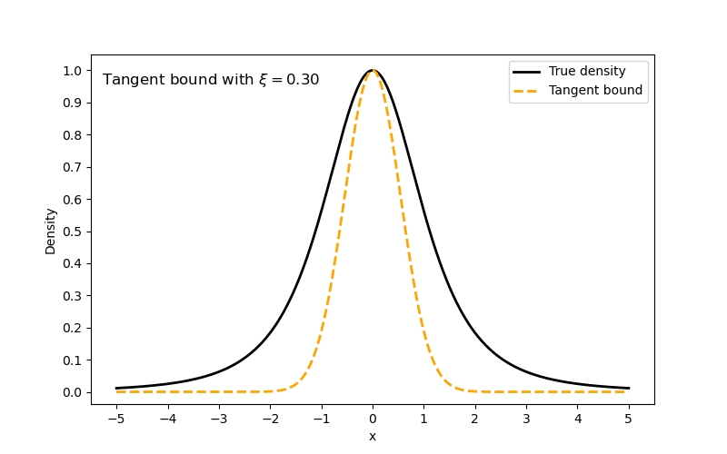

# TAVIE: A Generalized Tangent Approximation Framework for Strongly Super-Gaussian Likelihoods

[](https://www.python.org/)
[](./LICENSE)
[](https://arxiv.org/abs/2504.05431)
[](https://github.com/Roy-SR-007/TAVIE/network)
[](https://github.com/Roy-SR-007/TAVIE)
[](https://github.com/Roy-SR-007/TAVIE/commits/main)
[](https://github.com/Roy-SR-007/TAVIE/issues)
[](https://github.com/Roy-SR-007/TAVIE/pulls)


<p align="center">
  
</p>

This repository holds the implementations and source code of *Tangent Approximation based Variational InferencE* (**TAVIE**) proposed in Roy, S., Dey, P., Pati, D., & Mallick, B. K. (2025), *A Generalized Tangent Approximation Framework for Strongly Super‑Gaussian Likelihoods*, [arXiv:2504.05431](https://arxiv.org/abs/2504.05431).

---

### Developers and Maintainers

**Somjit Roy**  
Department of Statistics  
Texas A&M University, College Station, TX, USA  

📧 Email: [sroy_123@tamu.edu](mailto:sroy_123@tamu.edu)  
🌐 Website: [https://roy-sr-007.github.io](https://roy-sr-007.github.io)

**Pritam Dey**  
Department of Statistics  
Texas A&M University, College Station, TX, USA  

📧 Email: [pritam.dey@tamu.edu](mailto:pritam.dey@tamu.edu)  
🌐 Website: [https://pritamdey.github.io](https://pritamdey.github.io)

---

### NEWS

- This is the first official release of TAVIE v1.0.0 on GitHub.
- Explore different example cases, settings and usage of TAVIE across various strongly super-Gaussian (SSG) likelihoods with comparison against other variational inference (VI) algorithms.
- Application of TAVIE to real world data, to be added soon.

---

### Overview

*Variational inference* (VI), a concept rooted from statistical physics, has gained recent traction as a contender to prevalent Markov chain Monte Carlo (MCMC) sampling techniques used for posterior inference. VI has transformed approximate Bayesian inference through its power of scaling compute time under big data with applications extending out to the realm of *machine learning*, specifically in *graphical models* ([Wainwright and Jordan, 2008](https://www.nowpublishers.com/article/Details/MAL-001); [Jordan et al., 1999](https://link.springer.com/article/10.1023/A:1007665907178)), *hidden Markov models* (HMMs) ([MacKay, 1997](http://www.inference.org.uk/mackay/ensemblePaper.pdf)), *latent class models* ([Blei et al., 2003](https://jmlr.csail.mit.edu/papers/v3/blei03a.html)), and *neural networks* (NNs) ([Graves, 2011](https://papers.nips.cc/paper_files/paper/2011/hash/7eb3c8be3d411e8ebfab08eba5f49632-Abstract.html)). *Tangent approximation* ([Jaakkola and Jordan, 2000](https://link.springer.com/article/10.1023/A:1008932416310)), forming a popular class of VI techniques in intractable non-conjugate models has been used in diverse modeling frameworks like *low-rank approximations* ([Srebro and Jaakkola, 2003](https://people.csail.mit.edu/tommi/papers/SreJaa-icml03.pdf)), *sparse kernel machines* ([Shi and Yu, 2019](https://proceedings.neurips.cc/paper/2019/hash/bcc0d400288793e8bdcd7c19a8ac0c2b-Abstract.html)), and *online prediction* ([Konagayoshi and Watanabe, 2019](https://proceedings.mlr.press/v101/konagayoshi19a.html)). However, these applications have been primarily confined to logistic regression setting with [Ghosh et al., 2022](https://www.jmlr.org/papers/v23/21-0190.html) being the first ones to investigate optimality and algorithmic stability of tangent transformation based variational inference in logit and multinomial logit models. Taking a step forward, we develop TAVIE for SSG likelihood functions which encompasses a broad class of flexible probability models beyond the framework of logit models. Based on the principle of *convex duality*, TAVIE obtains a quadratic lower bound of the corresponding log-likelihood, thus inducing conjugacy with Gaussian priors over the model parameters. With TAVIE, we also address the challenge of rigorously characterizing the statistical behavior of the variational posterior by developing optimality (near-minimax variational risk bounds) under the fractional likelihood setup.

<p align="center">
  
  <br><em>Tangent minorizers for Student's-t likelihood, animated over 50 values of the variational parameter ξ</em>
</p>

TAVIE works for a large class of SSG likelihoods, currently comprising mainly of two types of families:
- *Type I families*: These comprise of linear regression models with heavy-tailed error distributions. Notable families of error distributions which can be addressed by TAVIE include the Laplace (Double-Exponential) and Student's-t. In general, any scaled-mixture of zero-mean Gaussian distributions have the SSG form, and thus can be implemented using TAVIE.
- *Type II families*: These comprise of generalized linear models (GLMs) with Binomial (including Bernoulli/Logistic) and Negative-Binomial response distributions.
- *Bayesian Quantlile Regression*: As an extension of the Type-I likelihood to the asymmetric Laplace distribution.

Due to the large class of models which can be fitted and infered from using TAVIE, it can be applied to a broad class of real world problems spanning applications in finance and economics, as well as in biostatistics viz., gene expression modeling, microbiome studies and neuroscience.

---

### Installation and Dependencies

To get started with TAVIE, which is build on `Python==3.13.5`, clone the current Github repository and install the required dependencies:

* `ipython==8.30.0`
* `matplotlib==3.10.3`
* `numpy==2.3.2`
* `pandas==2.3.1`
* `rich==14.1.0`
* `scikit_learn==1.7.1`
* `scipy==1.16.0`
* `torch==2.7.1`
* `tqdm==4.67.1`

```bash
# using SSH on bash
git clone git@github.com:Roy-SR-007/TAVIE.git

# or, using HTTPS on bash
git clone https://github.com/Roy-SR-007/TAVIE.git

# moving to the TAVIE directory
cd TAVIE

# install the required dependencies
pip install -r requirements.txt
```
---

### Functionalities of the TAVIE class

The `TAVIE` package wrapped in the TAVIE folder deals with the implementation of the corresponding VI algorithm under various SSG probability models. It provides flexible, modular support across different likelihood families and modeling tasks.


| Class             | Target SSG Model               | Supported Likelihoods                               | Prior Type                  |
|-------------------|--------------------------------|-----------------------------------------------------|-----------------------------|
| `TAVIE_loc_scale` | Location-scale family (Type I) | Laplace, Student’s-t, Custom location-scale         | Gaussian × Inverse-Gamma    |
| `TAVIE_QR`         | Quantile Regression           | Asymmetric Laplace (Quantile Regression)            | Gaussian                    |
| `TAVIE_type_II`    | GLMs (Exponential Family)     | Binomial, Negative Binomial                         | Gaussian                    |

---

For importing all these above-mentioned classes and initializing them at once:

```python
# importing all the TAVIE classes
from TAVIE import *

# initializing the TAVIE location-scale, TAVIE_QR, and TAVIE_type_II models respectively
## following is the location-scale example for 'laplace', other options are 'student' and 'loc_scale' (for general location-scale family)
loc_scale_model = TAVIE_loc_scale(fit_intercept=True, scale_X=False, scale_y=False, family="laplace", afunc=None, cfunc=None)

qr_model = TAVIE(fit_intercept=True, scale_X=False, scale_y=False)

## following is the Type II SSG example for 'binomial' (logistic regression), the other option is 'negbin' for negative-binomial regression
type_II_model = TAVIE_type_II(fint_intercept=True, scale_X=False, family="binomial")
```

**Note**: When initializing the TAVIE location-scale model for `laplace` or `student`, `afunc` and `cfunc` are computed in-built, whereas if a custom location-scale family is chosen, the corresponding callable functions for `afunc` and `cfunc` are to be provided to `TAVIE_loc_scale()`.

---

### Components of each TAVIE class

For each of the TAVIE class listed above, following are the components and their respective functionalities.


| Method Name                   | `TAVIE_loc_scale` | `TAVIE_type_II` | `TAVIE_QR` | Description                                                                 |
|-------------------------------|-------------------|-----------------|------------|-----------------------------------------------------------------------------|
| `fit()`                       | ✅                | ✅               | ✅         | Fits the TAVIE model to data using                                          |
| `get_TAVIE_means()`           | ✅                | ✅               | ✅         | Returns (and optionally displays) the TAVIE posterior means of parameters   |
| `get_variational_estimates()` | ✅                | ✅               | ✅         | Returns a dictionary of variational parameters (mean, covariance)           |
| `get_elbo()`                  | ✅                | ✅               | ✅         | Returns ELBO values tracked across iterations                               |

✅ = Supported. We give example usage of each of these above listed functions below for various SSG likelihoods considered in TAVIE.

---

### TAVIE in action for SSG Type I family: Laplace likelihood

We consider showing the utilities of each components in the `TAVIE_loc_scale()` class, particularly for the SSG Type I family having the *Laplace* likelihood of the form:

$y_i = \beta_0 + \mathbf{X}_i^\top \boldsymbol{\beta} + \epsilon_i, \quad \text{where } \epsilon_i \sim \text{Laplace}(0, \sigma^2=\tau^{-2})$, for $i=1,2,\ldots,n$ with $f_{\text{Laplace}}(\epsilon \mid \tau^2) = \frac{\sqrt{\tau^2}}{2} \exp\left( -\sqrt{\tau^2} \cdot |\epsilon| \right)$
